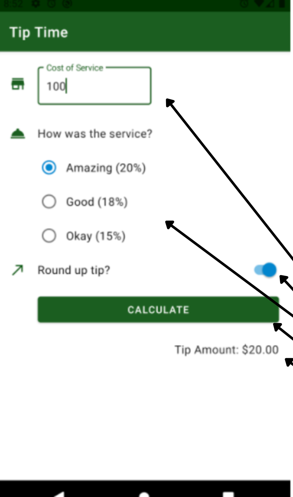

# App Crypto Look

App para practicar:
 - El uso de Radio buttons
 - Generar listado con .map
 - Iterar entries de un mapa
 - Switch y Radio 
 - onChanged y value
 - setState(){} para actualizar estado de widgets

## Getting Started

Recuerda que despues de clonar el proyecto, abrir una terminal dentro de la carpeta del proyecto y ejecutar el comando:

```sh
flutter packages get
``` 

## App Screenshot


